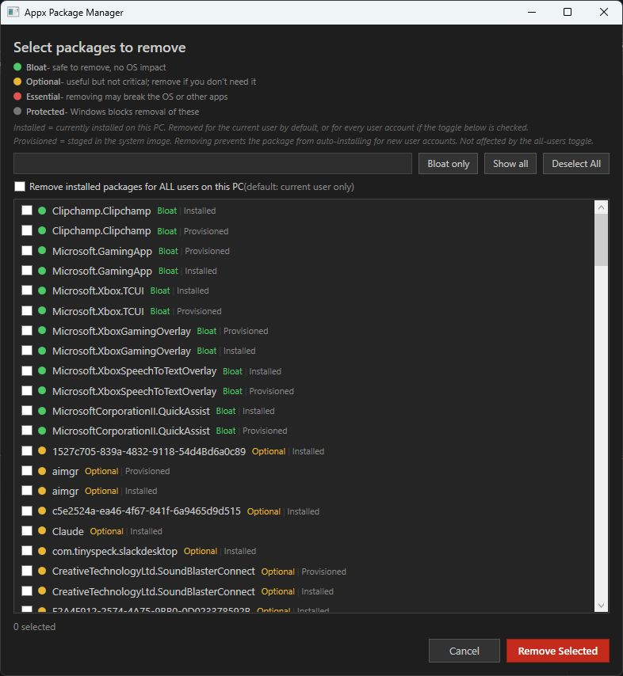
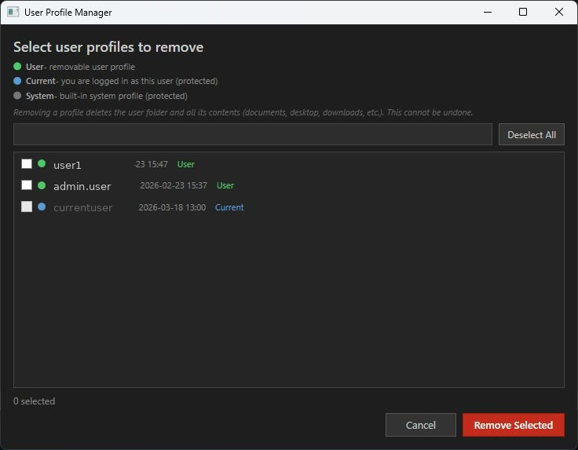

# windows-admin-tools

GUI tools for Windows system administration. PowerShell scripts with WPF dark-theme interfaces, color-coded risk classification, and optional ps2exe compilation.

> **Both tools require Administrator privileges.** They self-elevate via UAC if not already running as admin.

> [!WARNING]
> Use these tools at your own risk. Removing the wrong packages or profiles can result in **permanent data loss** and may break your system. Always double-check your selections before confirming. There is no undo.

---

## Tools

### Setup-WTAdminTask.ps1

One-time setup script that creates a Windows Task Scheduler entry to launch Windows Terminal with full admin privileges — **no UAC prompt on every launch**.

**How it works:**
- Registers a scheduled task that runs `wt.exe` at the `Highest` privilege level under your user account
- Creates a desktop shortcut that triggers the task via `schtasks /run`
- Because Task Scheduler holds the elevated token from registration time, Windows skips the UAC prompt on each launch

**Features:**
- Self-elevating — just double-click it; it will re-launch itself as Administrator automatically
- One-time setup — delete the script after running, the shortcut and task persist
- No password required at launch — the task runs interactively as you, elevated

**Usage:**
```powershell
# Just double-click the script — it self-elevates and sets everything up
.\Setup-WTAdminTask.ps1
```

After running, a **"Windows Terminal Admin"** shortcut will appear on your desktop. Double-clicking it opens an elevated Windows Terminal with no UAC prompt.

> [!NOTE]
> The script automatically detects the current user and `wt.exe` path via environment variables — works for any user with no edits needed.

---

### AppxManager.ps1

Interactively remove Appx (UWP) packages via a checkbox GUI, or run unattended from a list file.

**Features:**
- Lists all installed and provisioned packages in a searchable, filterable WPF window
- Color-coded risk tiers:
  - 🟢 **Bloat** — safe to remove (ads, games, social apps, etc.)
  - 🟡 **Optional** — useful but not critical (Calculator, Notepad, Photos, etc.)
  - 🔴 **Essential** — removal may break the OS or other apps
  - ⚫ **Protected** — Windows blocks removal of these
- Toggle to remove installed packages for **all users** or current user only
- Provisioned removal prevents packages from auto-installing for new accounts
- Automated/unattended mode via `-ListFile targets.txt`
- `-WhatIf` support for dry runs
- Logs to `Desktop\AppxRemove.log`

**Usage:**
```powershell
# Interactive GUI
.\AppxManager.ps1

# Unattended (one package name or wildcard per line in targets.txt)
.\AppxManager.ps1 -ListFile .\targets.txt

# Dry run
.\AppxManager.ps1 -WhatIf
```

---

### ProfileManager.ps1

Interactively remove local Windows user profiles via a checkbox GUI.

**Features:**
- Lists all user profiles with username, profile folder size (calculated async), and last login date
- Color-coded tiers:
  - 🟢 **User** — removable profile
  - 🔵 **Current** — your own session (protected, cannot be selected)
  - ⚫ **System** — built-in accounts (protected)
- Removal deletes the profile folder and all its contents (documents, desktop, downloads, etc.) — **this cannot be undone**
- Logs to `Desktop\ProfileRemove.log`

**Usage:**
```powershell
.\ProfileManager.ps1
```

---

## Screenshots

### AppxManager


### ProfileManager


---

## Running the Scripts

1. Open PowerShell (the script will auto-elevate if needed)
2. Allow script execution if prompted:
   ```powershell
   Set-ExecutionPolicy -Scope CurrentUser -ExecutionPolicy RemoteSigned
   ```
3. Unblock the downloaded script files:
   ```powershell
   Unblock-File -Path .\AppxManager.ps1
   Unblock-File -Path .\ProfileManager.ps1
   ```
4. Run the script:
   ```powershell
   .\AppxManager.ps1
   # or
   .\ProfileManager.ps1
   ```

---

## Compiling to EXE with ps2exe

Both scripts can be compiled into standalone double-clickable `.exe` files that auto-elevate via UAC.

**Step 1 — Open PowerShell as Administrator**

Right-click the Start menu → **Windows PowerShell (Admin)**

**Step 2 — Allow PowerShell to install modules (one-time)**

If you've never installed a module before, run this first:
```powershell
Set-ExecutionPolicy -Scope CurrentUser -ExecutionPolicy RemoteSigned
```

**Step 3 — Install ps2exe (one-time)**

```powershell
Install-Module ps2exe -Scope CurrentUser
```

Type `Y` and press Enter if prompted to trust the repository.

**Step 4 — Navigate to the folder containing the scripts**

```powershell
cd "C:\path\to\your\scripts"
```

**Step 5 — Compile**

```powershell
Invoke-PS2EXE -InputFile .\AppxManager.ps1   -OutputFile .\AppxManager.exe   -RequireAdmin
Invoke-PS2EXE -InputFile .\ProfileManager.ps1 -OutputFile .\ProfileManager.exe -RequireAdmin
```

The `.exe` files will appear in the same folder. Double-click to run — they will prompt for admin via UAC automatically.

---

## Requirements

- Windows 10 / 11
- PowerShell 5.1 or later
- **Administrator privileges** (auto-requested via UAC)
- .NET / WPF (included with Windows)
